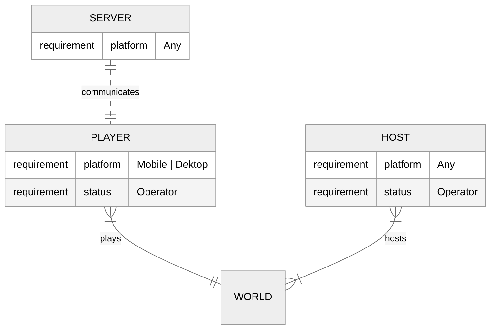

# Foreword

## Why use *bedrockpy*

*bedrockpy* does not serve as an alternative way of the Script API[^1] in
Minecraft. Using a websocket may gives you more control in the
backend (e.g. grabbing information of a website on the internt) but
provides less interaction with the Minecraft world and the player(s).

*bedrockpy* is nowhere officially documented and is not maintained
anymore and thus might be unstable or simply out of date considering
new features and changes made by recent updates. Websocket connections
are still possible because the feature is used by developers at
Minecraft for testing and debugging but it is not ssafe to say that
this feature will remain in future versions of Minecraft.

Websockets were initially (or still are) used in th Education Edition
of Minecraft to connect to a so called classroom[^2].

### When to use *bedrockpy* over a script add-on

* Interact with a world where add-ons cannot be simply downloaded
  (mainly worlds hosted by console players)
* Interact with the "outside world"
* Quickly write scripts for non-production programs
* Operations that are only possible with Python and not JavaScript

## Who *bedrockpy* is for

The documentation expects that you have at least a bit experience of
programming with [Python](https://www.python.org/) and how Minecraft
works.

### Gamers

Gamers that play Minecraft can enhance their experience by using
*bedrockpy*.

{{wip}}

### New into Coding

Instead of just sitting in front of a terminal, why not build something
with a fun game? Especially if you are new to Python and already play
Minecraft, *bedrockpy* might be a fun a way to start your first big or
small project.

### Console Players

Console players have no way of downloading add-ons from third-party
sources. *bedrockpy* lets you do a lot of things add-ons can do as
well.

{{wip}}

## Who can use *bedrockpy*

In order to let the server communicate with a client (a player
inside a Minecraft World), you need to use the `/connect` or
`/wsserver` command. This command can only be run on mobile
or dektop devices. Type that command in the game to find
out if your device is supported.

This does not mean, that you cannot establish a connection in
world made on other platforms. By joining for example a world by
someone on Playstation with your Android phone, it is possible
as long as the Android player has the operator status, to establish
a connection by using one of the above mentioned commands.

[^1]: https://learn.microsoft.com/en-us/minecraft/creator/documents/scriptinggettingstarted
[^2]: https://educommunity.minecraft.net/hc/en-us/articles/360047116652-Get-Started-with-Classroom-Mode-
